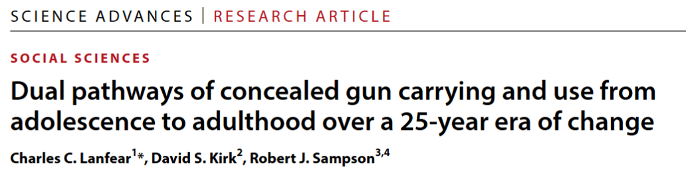
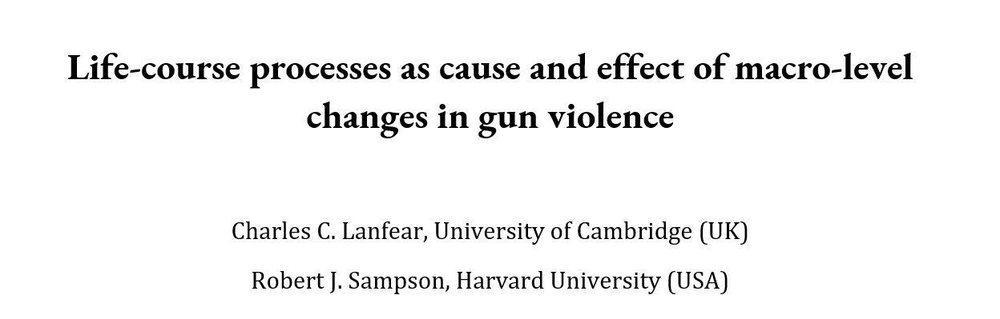
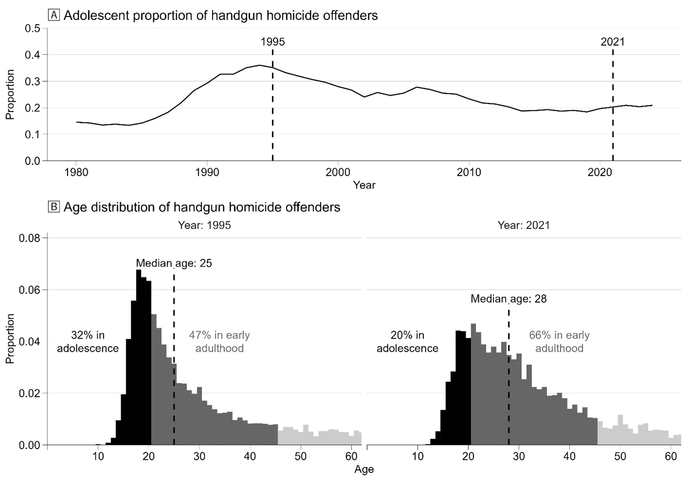
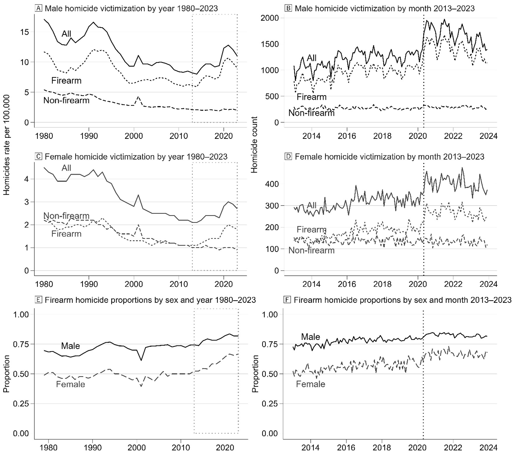
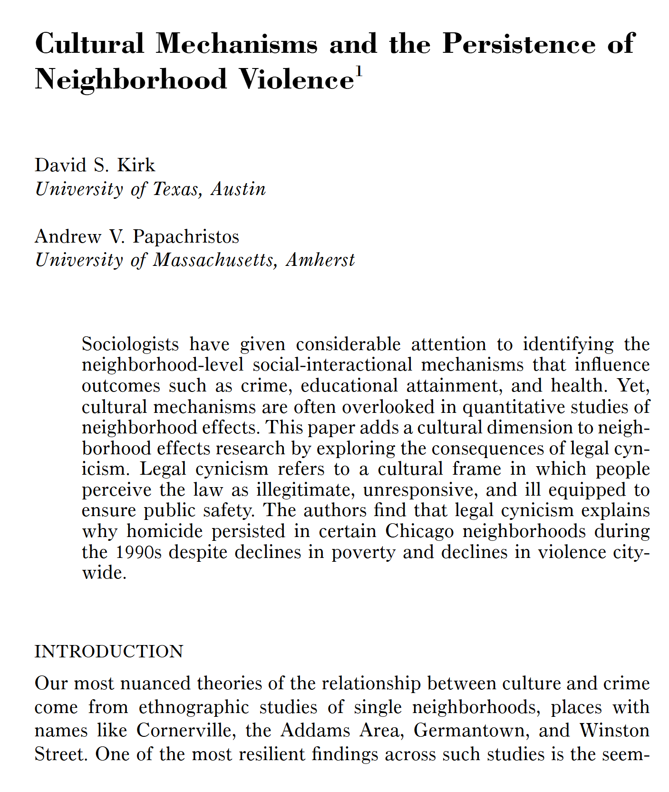
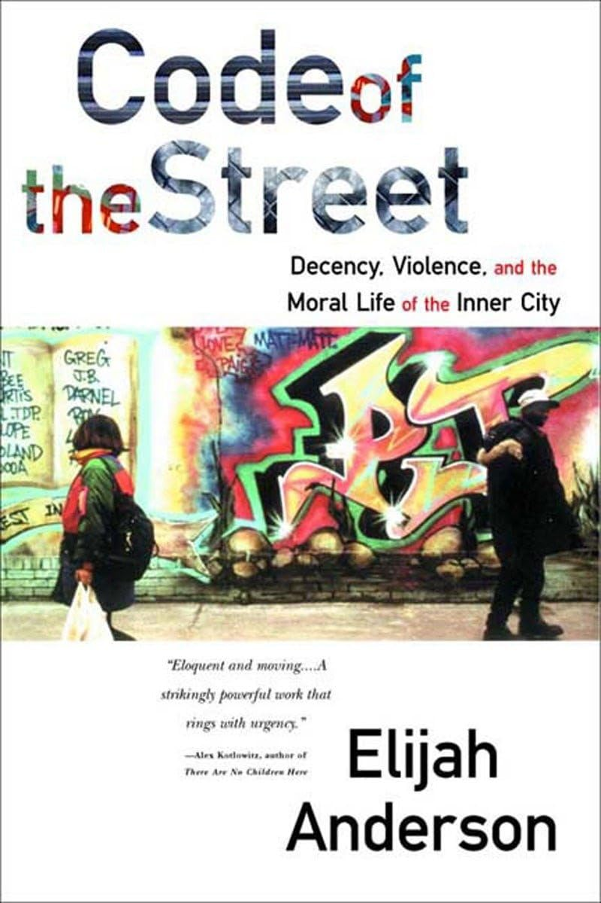
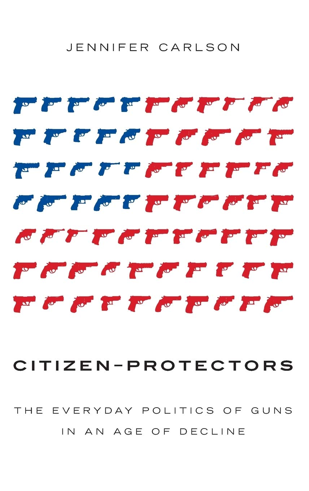
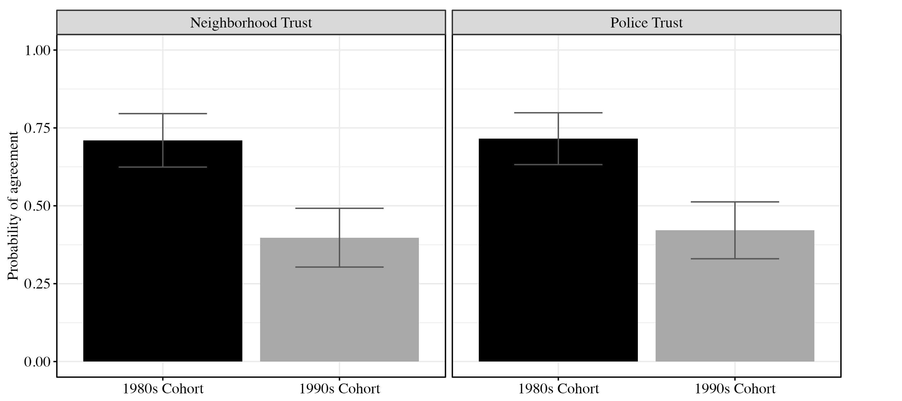
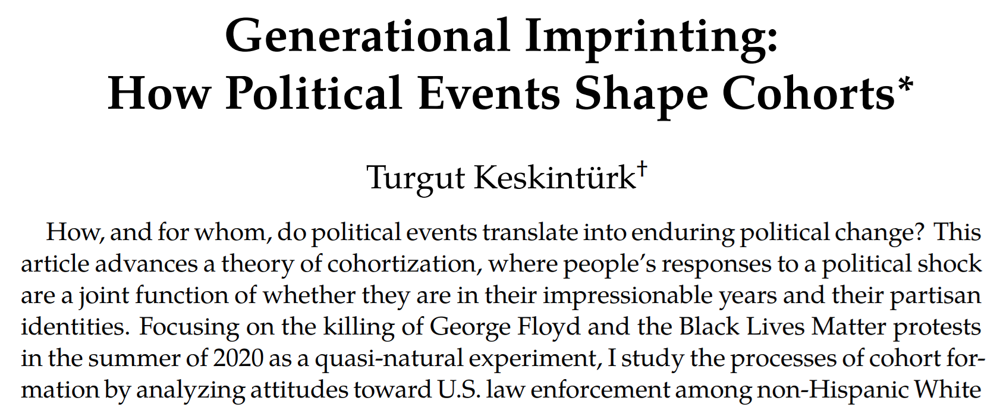

---
format:
  revealjs:
    theme: [night, assets/phdcn_style.scss]
    logo: img/phdcn_logo_white.svg
    incremental: false
    self-contained: false
    width: 1200
    height: 800
    auto-stretch: true
    title-slide: false
    pagetitle: "Policing and the life course: Current research and new questions"
editor: source
mouse-wheel: true
history: false
---


## [Policing and the life course:</br>]{.r-fit-text} {background-image="img/stephan-cassara-KnAIsBuitGg-unsplash.jpg" background-opacity="0.4"}

### Current research and new questions

&nbsp;

|                    |                           |
|-------------------:|:--------------------------|
| Charles C. Lanfear | *University of Cambridge* |


```{r setup}
#| include: false
knitr::opts_chunk$set(dev = "ragg_png",  
                      dev.args = list(bg = 'transparent'),
                      message = FALSE,
                      echo = FALSE,
                      warning = FALSE,
                      fig.showtext = TRUE,
                      fig.retina = 5,
                      fig.align = "center")
library(tidyverse)
library(ggforce)
library(showtext)
library(janitor)
library(flextable)
library(patchwork)
library(ggtext)
library(survey)
source("./syntax/project_functions.R")

plot_font <- "Open Sans"
font_add_google(name = plot_font)
showtext_auto()
gg_color_hue <- function(n) {
  hues = seq(15, 375, length = n + 1)
  hcl(h = hues, l = 65, c = 100)[1:n]
}
```


# The {background-image="img/max-bender-yb7Yg3Rv7WA-unsplash.jpg" background-opacity="0.4"}


##  {background-image="img/max-bender-yb7Yg3Rv7WA-unsplash.jpg" background-opacity="0.2"}

### Project on Human Development in Chicago Neighborhoods

::: nonincremental
-   6200 children from 7 age cohorts, born 1978 to 1996
-   3 interviews from 1995--2003
-   Representative of Chicago and its neighborhoods

:::


##  {background-image="img/max-bender-yb7Yg3Rv7WA-unsplash.jpg" background-opacity="0.2"}

### Project on Human Development in Chicago Neighborhoods

::: nonincremental
-   6200 children from 7 age cohorts, born 1978 to 1996
-   3 interviews from 1995--2003
-   Representative of Chicago and its neighborhoods
:::

::::: columns

:::: {.column width="70%"}

### PHDCN+

::: nonincremental
-   60% subsample of 4 cohorts
-   1057 interviewed in 2012
-   682 followed-up in 2021
-   Followed throughout the US
:::

::::

:::: {.column width="30%"}
Funded by:<br>
::::

:::::


## Accelerated cohort design {background-image="img/max-bender-yb7Yg3Rv7WA-unsplash.jpg" background-opacity="0.2"}

```{r phdcn-timeline, cache = TRUE}
#| fig.width: 9
#| fig.height: 6
df <- tribble(
  ~cohort, ~time, ~year, ~age, 
  0,  1, 1995,  0,
  0,  2, 2021, 25,
  3,  1, 1995,  3,
  3,  2, 2002, 11,
  6,  1, 1995,  6,
  6,  2, 2002, 14,
  9,  1, 1995, 9, 
  9,  2, 2021, 34,
  12, 1, 1995, 12,
  12, 2, 2021, 37,
  15, 1, 1995, 15,
  15, 2, 2021, 40,
  18, 1, 1995, 18,
  18, 2, 2002, 26,
) %>%
  mutate(focus = ifelse(cohort %in% c(0,9,12,15), "yes", "no"))

cs_df <- tibble(
  survey = rep(c("PHDCN-CS", "CCAHS"), each = 7),
  year   = rep(c(1995, 2002), each = 7),
  cohort = rep(seq(0,18, by = 3), length.out = 14)
)
wave_df <- tibble(
  survey = rep(1:5, length.out = 35),
  year   = rep(c(1995, 1998.5, 2002, 2012, 2021), length.out = 35),
  cohort = rep(seq(0,18, by = 3), each = 5)
) %>%
  filter(year <= 2002 | cohort %in% c(0, 9, 15)) %>%
  mutate(group = 
           case_when(
            year <= 2002 ~ year, 
            year > 2002 & cohort %in% c(9,15,18) ~ year,
            year > 2002 & cohort == 0 ~ year -1),
         phdcn = ifelse(year <= 2002, "PHDCN", "PHDCN+"))


ggplot(df, aes(x = year, y = cohort, group = cohort)) + 
   # geom_mark_rect(data = cs_df, aes(group = year), fill = "#00BFC4", color = NA, expand = unit(7, "mm"), ) +
    geom_mark_rect(data = wave_df, aes(group = group, fill = phdcn), color = NA, expand = unit(6, "mm")) +
  geom_line(size = 3, aes(color = focus)) +
  geom_richtext(aes(label = age, fill = focus), 
                size = 5, label.colour = NA, text.color = "black") +
  theme_minimal(base_size = 24) +
  scale_fill_manual(values = c("yes" = "white", "no" = "grey50", "PHDCN" = "#F8766D", "PHDCN+" = "#00BFC4")) +
  scale_color_manual(values = c("yes" = "white", "no" = "grey50", "PHDCN" = "#F8766D", "PHDCN+" = "#00BFC4")) +
  labs(y = "Cohort Ages", x= NULL) +
  scale_x_continuous(breaks = seq(1995, 2021, by = 5), limits = c(1994,2022)) +
  scale_y_continuous(limits = c(-1,22)) +
  
  annotate("text", x = 1998.5, y = 21.25, family = plot_font, label = "Original PHDCN\nWaves 1–3", color = "#F8766D", size = 5) +
  annotate("text", x = 2016.5, y = 21.25, family = plot_font, label = "PHDCN+\nWaves 4 & 5", color = "#00BFC4", size = 5) +
  theme(panel.grid = element_blank(),
        axis.text.y = element_blank(),
        axis.text.x = element_text(color = "grey90"),
        text = element_text(family = plot_font,  color = "white"),
        panel.background = element_rect(fill = "transparent",colour = NA),
        plot.background = element_rect(fill = "transparent",colour = NA),
        legend.position = "none")
```


## {background-image="img/clay-banks-nsAn3nSW5T0-unsplash.jpg" background-opacity="0.2"}

{fig-align="center"}

. . .

* When does **onset** of concealed carry occur?

. . .

* Is there **continuity** in carry over the life course?

   * Are adolescent carriers still carrying today?
   * Does it differ for legal and illegal carry? 

. . .

* Does **exposure to gun violence** predict later carrying?

   * Does it differ for adolescents and adults?
   


## [Two pathways of gun carrying]{.r-fit-text}{background-image="img/clay-banks-nsAn3nSW5T0-unsplash.jpg" background-opacity="0.2"}

&nbsp;

::::: {.columns}

:::: {.column}

::: {.fragment}

**Adolescent-onset**

* $\frac{1}{3}$ of those ever carrying
* Most age out
* Associated with immediate **dangerous contexts**
   * High risk of use

:::

::::

:::: {.column}

::: {.fragment}

**Adult-onset**

* $\frac{2}{3}$ of those ever carrying
* Most still carrying today
* Associated with **insecurity** and **diffuse threats**
   * Low but cumulative use risk

:::

::::

:::::


## {background-image="img/pedro-lastra-5Bv3EcijAl4-unsplash.jpg" background-opacity="0.2"}




&nbsp;

::: {style="text-align: center;"}

*How do these dual pathways of carrying relate to macro-level changes in gun violence 1980--2024?*

:::


## {background-image="img/pedro-lastra-5Bv3EcijAl4-unsplash.jpg" background-opacity="0.2"}



## {background-image="img/pedro-lastra-5Bv3EcijAl4-unsplash.jpg" background-opacity="0.2"}



## [Two similar periods of high gun violence, except...]{.r-fit-text}{background-image="img/pedro-lastra-5Bv3EcijAl4-unsplash.jpg" background-opacity="0.2"}

::::: {.columns}

:::: {.column width="45%"}

**Early 1990s**

::: {.fragment fragment-index=1}

* Concentrated in adolescence

:::

::: {.fragment fragment-index=2}

* Slow accumulation:
   * *Deindustrialization, mass incarceration etc.*

:::

::: {.fragment fragment-index=3}

* Context: Concentrated disadvantage, gangs, and illicit markets

:::

::::

:::: {.column width="10%"}

&nbsp;

::::

:::: {.column width="45%"}

**2016-2021**

::: {.fragment fragment-index=1}

* Concentrated in adulthood

:::

::: {.fragment fragment-index=2}

* Rapid destabilization:
   * *Trump, Ferguson, COVID-19, Floyd, etc.*

:::

::: {.fragment fragment-index=3}

* Context: Widespread insecurity, loss of faith in institutions

:::

::::

:::::

::: {.fragment fragment-index=4 style="text-align: center;"}

Both: **Legal cynicism** and **distrust**

:::


# [Legal cynicism, distrust,</br>and gun carrying]{.r-fit-text}{background-image="img/benjamin-suter-mlOvsx4xdaA-unsplash.jpg" background-opacity="0.4"}

## {background-image="img/benjamin-suter-mlOvsx4xdaA-unsplash.jpg" background-opacity="0.2"}

:::: {.columns}

::: {.column width="55%"}

> a cultural frame in which people perceive the law as **illegitimate**, **unresponsive**, and **ill equipped** to ensure public safety.

> when **calling the police is not a viable option** to remedy one’s problems—individuals may instead **resolve their grievances by their own means**

:::

::: {.column width="45%"}



:::

::::


##  {background-image="img/benjamin-suter-mlOvsx4xdaA-unsplash.jpg" background-opacity="0.2"}

:::: {.columns}

::: {.column width="60%"}

>  The inclination to violence springs from the circumstances of life... The code of the street is actually a cultural adaptation to a **profound lack of faith in the police** and the judicial system

Guns also:

* Confer status
* Deter threats
* Facilitate dominance

:::

::: {.column width="40%"}



:::

::::

::: {style="text-align: center;"}

*Concentrated disadvantage &rarr; **alienation** from institutions*

:::


## {background-image="img/benjamin-suter-mlOvsx4xdaA-unsplash.jpg" background-opacity="0.2"}

:::: {.columns}

::: {.column width="65%"}

> ... two racially differentiated beliefs promote legal gun carrying: The belief common among most carriers that police are **inadequate protectors**—and thus one may carry a gun as protection from crime—and the belief more common among non-white carriers that police are **coercive violators** of rights—and thus one may carry a gun as protection from and resistance to the oppressive state (Lanfear et al. 2024)

:::

::: {.column width="35%"}



:::

::::


::: {style="text-align: center;"}

*Linked to diffuse social and economic insecurities*

:::


## {background-image="img/benjamin-suter-mlOvsx4xdaA-unsplash.jpg" background-opacity="0.2"}


{fig-align="center"}

::: {style="text-align: center;"}

> Despite having much higher arrest rates, the cohort born in 1987 has greater levels of **trust in police and neighbors** at age twenty-five than counterparts born just nine years later, adjusting for background factors and early-life conditions (Sampson 2026)

:::


## Cynicism, distrust, and guns {background-image="img/benjamin-suter-mlOvsx4xdaA-unsplash.jpg" background-opacity="0.2"}

> legal cynicism promotes concealed gun carrying as a response to **perceived insecurity**.

> legal cynicism in the 1990s was primarily a neighborhood phenomenon because the factors producing it were local to neighborhoods; in contrast... legal cynicism of the mid-2010s onward is rooted in **macrosocial changes**...

> These changes were shaped by a structural legal context forged in **distinctly American gun culture**.


## [Legal cynicism, distrust, and violence]{.r-fit-text}{background-image="img/benjamin-suter-mlOvsx4xdaA-unsplash.jpg" background-opacity="0.2"}

&nbsp;

```{dot}
//| fig-width: 9
digraph G{
  graph [layout=neato, bgcolor="transparent"]
  node [shape = plaintext, fontname="Open Sans", fontcolor="white"]
  edge [color="white"]
  
  
  legal [pos = "0,  4.!", label = "Legal\ncynicism"]
  carry [pos = "1,  2.5!", label = "Gun carry"]
  trust [pos = "0,  1!", label = "Generalized\ndisrust"]
  sit [pos = "4,  2.5!", label = "Conflict\nsituations"]
  viol [pos = "5,  4!", label = "Violence"]
  
  options [pos = "2.25,  3.6!", label = "Perceived\noptions", fontcolor = yellow]
  lethal [pos = "2.25,  2.5!", label = "Lethal\npotential", fontcolor = yellow]
  fear [pos = "2.25,  1.35!", label = "Fear and\nsuspicion", fontcolor = yellow]
  emergence [pos = "5.25,  3.25!", label = "Emergence", fontcolor = yellow]
  
  legal -> carry
  trust -> carry
  carry -> sit
  legal -> sit
  trust -> sit
  sit -> viol
}
```


## [Dual process model of gun carrying and gun violence]{.r-fit-text}{background-image="img/joel-mott-s-rsM-AktbA-unsplash.jpg" background-opacity="0.2"}


::::: {.columns}

:::: {.column width="50%"}

::: {.fragment}

```{dot}
//| fig-width: 6
digraph G{
  graph [layout=neato, bgcolor="transparent"]
  node [shape = plaintext, fontname="Open Sans", fontcolor="white"]
  edge [color="white"]
  
  btitle [pos = "1.5,  5.25!", label = "Adolescent Process", fontcolor = yellow]
  bsc1 [pos = "0,  4.5!", label = "Local instability\n(Risky situations)"]
  bsi [pos = "0.5,  3!", label = "Specific distrust\n& cynicism"]
  bsa [pos = "2.5,  3!", label = "Youth gun\ncarrying"]
  bsc2 [pos = "3,  4.5!", label = "Increased\nyouth\nviolence"]

  bsc1 -> bsi
  bsc1 -> bsc2
  bsi -> bsa
  bsa -> bsc2
}
```

:::

::::

:::: {.column width="50%"}

::: {.fragment}

```{dot}
//| fig-width: 6
digraph G{
  graph [layout=neato, bgcolor="transparent"]
  node [shape = plaintext, fontname="Open Sans", fontcolor="white"]
  edge [color="white"]
  
  title [pos = "1.5,  2.25!", label = "Adult Process", fontcolor = yellow]
  sc1 [pos = "0,  1.5!", label = "Societal instability\n(Risky world)"]
  si [pos = "0.5,  0!", label = "Diffuse distrust\n& cynicism"]
  sa [pos = "2.5,  0!", label = "Adult gun\ncarrying"]
  sc2 [pos = "3,  1.5!", label = "Increased\nadult\nviolence"]
  
  sc1 -> si
  sc1 -> sc2
  si -> sa
  sa -> sc2
}
```

:::

::::

::::

::: {.fragment style="text-align: center;"}

*2021 was not a reprise of the 1990s; both were the result of **differential activation** of processes responding to macrosocial context*

:::


# New questions {background-image="img/benjamin-suter-mpLex62zVKQ-unsplash.jpg" background-opacity="0.4"}


## Theories are rooted in context {background-image="img/benjamin-suter-mpLex62zVKQ-unsplash.jpg" background-opacity="0.2"}


* Legal cynicism: Disadvantaged 1990s US neighborhoods
* Legitimacy and trust: 1980s-2000s UK and US

. . .

But today...

::: {.incremental}

* Most people have *very little* contact with **police**
* Most people have *a lot* of contact with **social media**

:::


. . .


*How do we build trust and legitimacy and fight cynicism when most information no longer comes from personal experience, close ties, or neighborhoods?*


## Age, period, and cohort effects




* How persistent are these orientations?
* What are the formative years?
* What are the long-term societal implications?


## Feedback and questions {background-image="img/benjamin-suter-mpLex62zVKQ-unsplash.jpg" background-opacity="0.4"}

Contact:

| Charles C. Lanfear
| Institute of Criminology
| University of Cambridge
| [cl948\@cam.ac.uk](mailto:cl948@cam.ac.uk)

&zwj;

For more about the PHDCN+:

| PHDCN\@fas.harvard.edu
| <https://sites.harvard.edu/phdcn/>
| [https://doi.org/10.1007/s40865-022-00203-0](https://sites.harvard.edu/phdcn/)

